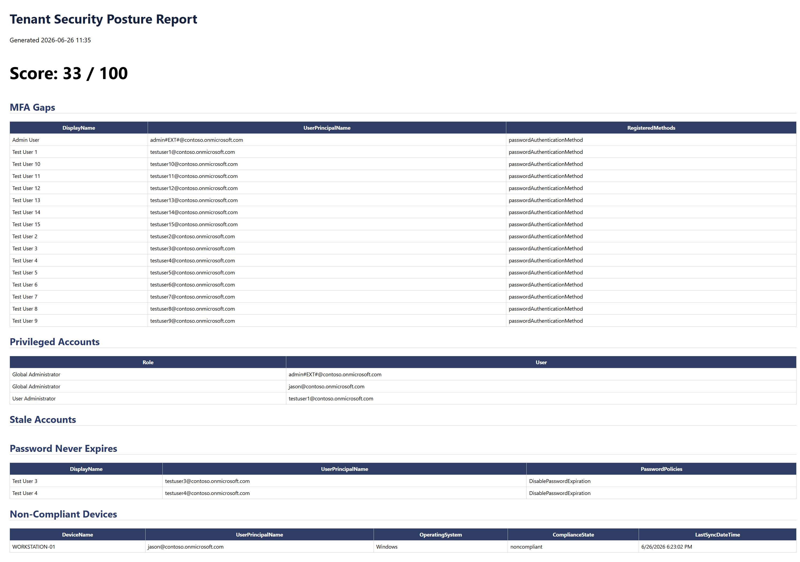
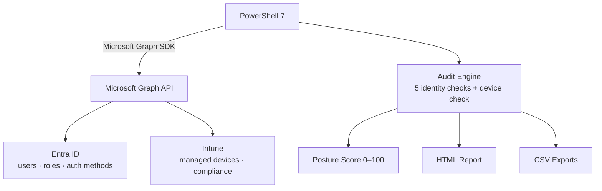

# Entra ID & Intune Security Posture Auditor

A PowerShell tool that audits a Microsoft 365 tenant for identity and device
security gaps using the Microsoft Graph API, then scores the tenant's posture
and generates a report.

## The Problem

Misconfigured identities and non-compliant devices are among the most common
causes of cloud breaches — unprotected admin accounts, missing MFA, and
over-privileged users. Manually reviewing these across a tenant is slow and
error-prone. This tool automates that review into a single, repeatable scan.

## What It Checks

| Check | Flags |
|-------|-------|
| MFA gaps | Enabled users with no MFA method registered |
| Privileged accounts | Members of high-privilege admin roles |
| Password policy | Accounts set to never expire |
| Stale accounts | Enabled users with no recent sign-in |
| Guest hygiene | External/guest accounts and their state |
| Device compliance | Non-compliant or stale Intune-managed devices |

Each run produces a weighted **posture score (0–100)** and an HTML report.

## Sample Output



> Example finding: the auditor surfaced an external (`#EXT#`) account holding
> Global Administrator with no MFA registered — a high-severity combination and
> a textbook initial-access path — without it being part of the seeded test data.

## How scoring works

The tenant starts at 100 and loses points for each finding, weighted by how much risk it represents:

- Privileged account issues: 4 points each
- MFA gaps and non-compliant devices: 3 points each
- Stale accounts and password-never-expires: 2 points each

The score is floored at 0. I weighted privileged access highest because an over-privileged or unprotected admin account has the largest blast radius if compromised, while password-hygiene issues are real but lower-impact.

## Architecture



## Setup

**Prerequisites**
- PowerShell 7
- Microsoft Graph PowerShell SDK
- An Entra ID tenant and an account with admin consent rights

**Install the required modules**
```powershell
Install-Module Microsoft.Graph.Authentication, Microsoft.Graph.Users,
  Microsoft.Graph.Identity.DirectoryManagement,
  Microsoft.Graph.Identity.Governance,
  Microsoft.Graph.DeviceManagement -Scope CurrentUser
```

## Usage
```powershell
Connect-MgGraph -Scopes "User.Read.All","Directory.Read.All",
  "UserAuthenticationMethod.Read.All","RoleManagement.Read.Directory",
  "DeviceManagementManagedDevices.Read.All"

. ./src/Invoke-PostureAudit.ps1   # runs the full audit, writes reports/report.html
```

## Design Notes

- **Least privilege:** runs entirely on read-only Graph scopes; the separate
  seeding script is the only component needing write access.
- **Live MFA detection:** the authentication-methods registration *report* had
  unreliable latency in a fresh tenant, so MFA is checked by querying each
  user's registered methods directly — no batch-processing delay.
- **Risk-weighted scoring:** privileged-access findings are weighted highest
  (largest blast radius), then MFA gaps and device compliance, then hygiene
  issues — an explicit, defensible risk model.

## Limitations

- Stale-account detection relies on `signInActivity`, which requires an
  Entra ID P1/P2 license to populate and only reflects real sign-in history.
- Built and validated in a sandbox tenant with seeded test data.

## Skills Demonstrated

PowerShell · Microsoft Graph API · Entra ID · Microsoft Intune · Identity & Access Management (MFA, RBAC, Privileged access) · Security Posture Assessment · Least-privilege Design · Git

## Future Enhancements

- App-only authentication for unattended, scheduled runs
- Deployment as an Azure Automation runbook
- Python component for findings enrichment
- Conditional Access policy coverage analysis